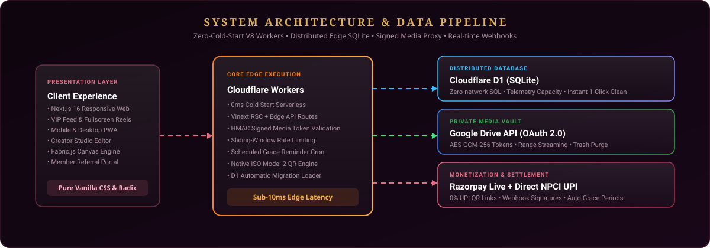

<div align="center">

<!-- Animated Luxury Hero Banner -->


<br/><br/>

<!-- Live Website Interactive Navigation Bar -->
<table align="center" border="0" cellpadding="0" cellspacing="0">
  <tr>
    <td align="center">
      <a href="https://ninakurainservices.in"><b>🌐 Live Website</b></a> &nbsp;•&nbsp;
      <a href="#-core-platform-features"><b>✨ Features</b></a> &nbsp;•&nbsp;
      <a href="#-system-architecture"><b>📐 Architecture</b></a> &nbsp;•&nbsp;
      <a href="#-instant-payment--qr-engine"><b>💳 Payment QR</b></a> &nbsp;•&nbsp;
      <a href="#-database-telemetry--storage-maintenance"><b>💾 Storage</b></a> &nbsp;•&nbsp;
      <a href="#-quick-start--local-development"><b>🚀 Quick Start</b></a>
    </td>
  </tr>
</table>

<br/>

<!-- Animated Live Status Bar -->
<a href="https://ninakurainservices.in">
  
</a>

<br/>

<!-- Technology Shields -->
<p align="center">
  
  
  
  
  
  
</p>

---

</div>

<br/>

## 🌟 Core Platform Features

<table width="100%">
<tr>
<td width="50%" valign="top">

### 🔞 VIP Member Lounge
* **Tiered Membership Gating**: Free Demo, Tier 1 (*Private Access*), Tier 2 (*Closer Access*), and Tier 3 (*Inner Circle*).
* **Immersive Full-Screen Reels**: Ultra-fast media streaming with short-lived HMAC signatures and byte-range seek support.
* **Community Interactions**: Verified replies, comment hearts, bookmarks, and private direct creator feedback inbox.
* **Smart Live Feed**: Background-polls every 15 seconds while visible, instant focus refresh, and smooth infinite scroll.

</td>
<td width="50%" valign="top">

### 💳 Instant Payment & QR Engine
* **Dynamic Amount Entry**: Enter any custom amount (e.g. ₹500, ₹1,200, ₹15,000) on PC or mobile phone.
* **Dual Gateway Architecture**:
  * 🟢 **Direct UPI (0% Fee)**: Standard NPCI URI opening directly into Google Pay, PhonePe, Paytm, or BHIM.
  * 🔴 **Razorpay Live Gateway**: Dynamic hosted links supporting Cards & Netbanking.
* **Branded Receipt Generator**: Pure TypeScript Model-2 QR engine exporting luxury receipt cards (`drawPaymentReceiptCard`).
* **1-Click Social Sharing**: Native mobile share sheet (`navigator.share`), WhatsApp web direct message, or image card download.

</td>
</tr>
<tr>
<td width="50%" valign="top">

### 🎨 Nina Studio Suite
* **Integrated Creative Editor**: Crop, filter, watermark, and grade photos/videos directly in the browser.
* **18 Editorial Tone Filters**: Seductive, Golden Hour, Noir Velvet, Film 35mm, Boudoir Luxe, Sunset Glow, and more.
* **Fabric.js Multi-layer Canvas**: Aspect-ratio presets (1:1 Square, 4:5 Portrait, 9:16 Reel Story), text overlays, and brand marks.
* **Reel Video Cutter**: Interactive timeline scrubbing, precision second-accurate trimming, and MP4 generation.

</td>
<td width="50%" valign="top">

### 💾 D1 Storage & Maintenance
* **Real-time Database Telemetry**: Exact SQLite byte measurement (`page_count * page_size`) against 500 MB D1 quota.
* **Table Breakdown Grid**: Instant counts for media assets, members, payments, activity logs, and auth sessions.
* **1-Click Smart Cleaner**: Safely purges expired OAuth tokens, stale sessions, and pruned logs without touching content.
* **Google Drive Quota Engine**: Live Drive storage telemetry, space breakdown (Drive Media vs Trash), and 1-click trash purge.

</td>
</tr>
</table>

---

## 📐 System Architecture

<div align="center">
  
</div>

<br/>

### Data Pipeline Overview:
1. **Edge Client**: Next.js App Router rendered by Cloudflare Workers with hybrid RSC hydration.
2. **Serverless Compute**: Cloudflare Workers V8 isolates execute with **0ms cold start** and zero idle costs.
3. **Database Layer**: Cloudflare D1 provides distributed serverless SQLite at the edge.
4. **Media Vault**: Private photos and videos stream via encrypted Google Drive OAuth 2.0 with time-limited token authentication.
5. **Billing Automation**: Razorpay signed webhooks (`subscription.charged`, `payment.failed`, etc.) automate instant access activation and 48-hour failed-renewal grace periods.

---

## 🎁 7-Day Referral Program

The platform implements an automated 7-day qualification referral system:

```
[Member Shares Link] ──> [First Friend Signs Up] ──> ⏳ 7-Day Window Starts!
                                                              │
                     ┌────────────────────────────────────────┴────────────────────────────────────────┐
                     ▼                                                                                 ▼
      Within 7 Days of 1st Referral                                                      After 7 Days Expired
   • Counted toward active milestones                                            • Recorded in "Total Refers" (All-Time)
   • 1 Sub: 7-Day Tier 1 Trial                                                   • Milestone rewards closed
   • 3 Subs: 7-Day Tier 2 Trial                                                  • Transparent status banner on card
   • 5 Subs: 7-Day Tier 3 Trial
```

* **All-Time Total Refers**: Always visible to the member so their cumulative impact is permanently recognized.
* **Strict 7-Day Eligibility**: Automatically locks milestone unlocks to referrals created within 7 days of the member's first referral.

---

## ⚡ Tech Stack & Specifications

| Layer | Component | Specification |
| :--- | :--- | :--- |
| **Compute** | [Cloudflare Workers](https://workers.cloudflare.com/) | Edge-native V8 serverless execution with 0ms cold starts |
| **Database** | [Cloudflare D1](https://developers.cloudflare.com/d1/) | Distributed serverless SQLite with Drizzle ORM |
| **Framework** | [Next.js 16 (App Router)](https://nextjs.org/) + [Vinext](https://github.com/cloudflare/vinext) | Hybrid RSC & client rendering optimized for Workers |
| **Styling** | Vanilla CSS + Radix UI + Lucide Icons | Dark luxury aesthetic (`#100610`, rose-wine gradients, glassmorphism) |
| **QR Engine** | Custom ISO/IEC 18004 Model 2 | Zero-dependency pure TypeScript with Reed-Solomon Error Correction |
| **Media Storage** | Google Drive API (OAuth 2.0) | Creator-owned private storage with signed streaming proxy |
| **Payments** | Razorpay Live + Direct NPCI UPI | Dual-channel payments with signed webhook verification |
| **Email Delivery** | Resend API | Transactional emails with idempotency keys & token hashing |

---

## 🚀 Quick Start & Local Development

### 1. Clone Repository & Install Dependencies
```bash
git clone https://github.com/Nina-Kurain/Nina-Kurain-Services.git
cd Nina-Kurain-Services
pnpm install
```

### 2. Environment Configuration
Create `.env` (or use `.env.production`):
```env
APP_ENV=production
APP_URL=https://ninakurainservices.in
ADMIN_EMAIL=insta.ninak12@gmail.com
ADMIN_PASSWORD_HASH=scrypt$...

# Payment Gateways
PAYMENT_MODE=live
RAZORPAY_KEY_ID=rzp_live_...
RAZORPAY_KEY_SECRET=...
RAZORPAY_WEBHOOK_SECRET=...

# Cloudflare & Storage
CLOUDFLARE_D1_DATABASE_NAME=site-creator-d1
CLOUDFLARE_D1_DATABASE_ID=65df4e58-5eef-459d-9540-8131a5f5cf9f
GOOGLE_DRIVE_CLIENT_ID=...
GOOGLE_DRIVE_CLIENT_SECRET=...
```

### 3. Run Locally
```bash
pnpm run dev
```
Open [http://localhost:3000](http://localhost:3000) in your browser.

### 4. Deploy to Cloudflare Edge
```bash
pnpm run deploy:cloudflare
```

---

<details>
<summary><b>🛡️ Security & Privacy Architecture</b></summary>

<br/>

* **Zero Plaintext Passwords**: Uses salted `scrypt` hashing with constant-time equality checks.
* **Signed Streaming URLs**: Media assets require short-lived HMAC signatures and member entitlement verification.
* **Webhook Signature Verification**: Razorpay payment confirmations require cryptographic HMAC-SHA256 signatures before activating subscriptions.
* **Encrypted OAuth Tokens**: Google Drive refresh tokens are encrypted at rest using AES-GCM-256 with key derivation.
* **Edge Rate-Limiting**: Sliding-window rate limiting on authentication and sensitive endpoints.

</details>

<details>
<summary><b>📁 Project Directory Structure</b></summary>

```
nina-kurain-membership/
├── app/                        # Next.js App Router pages & edge API endpoints
│   ├── admin/                  # Creator Studio & Live Admin dashboard
│   ├── api/                    # Studio, Auth, Webhooks, Integrations & Media proxy
│   ├── feed/                   # Member VIP exclusive feed & reels
│   └── globals.css             # Luxury dark-mode design system
├── components/                 # Reusable UI & admin components
│   ├── admin/                  # PaymentQrGenerator & DatabaseStorageManager
│   ├── media-editor/           # NinaStudioEditor & Fabric photo canvas
│   ├── post-viewer/            # Fullscreen reel & post viewers
│   └── referrals/              # MemberReferralCard & 7-day qualification tracker
├── db/                         # Drizzle schema definitions & SQL bindings
├── lib/                        # Core utilities & server services
│   ├── qr-code.ts              # Pure TypeScript ISO/IEC 18004 QR engine
│   └── server/                 # Auth, Billing, D1 DB, Email, Drive, & Storage stats
└── public/                     # High-res portraits, logos, icons, SVGs & sitemaps
```

</details>

---

<div align="center">

### ✦ Nina Kurain VIP Creator Club ✦
*Crafted for luxury aesthetics, private subscription security, and global edge performance.*

<br/>

<a href="https://ninakurainservices.in">
  
</a>

<br/><br/>

[](https://ninakurainservices.in)
[](https://ninakurainservices.in)

</div>
